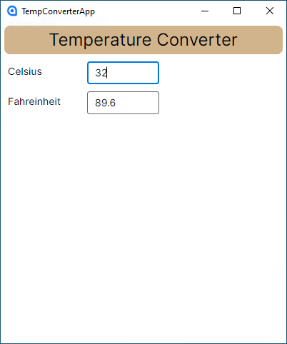
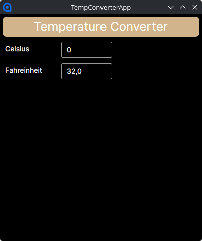

# Temperature Converter


A cross platform desktop app that converts temperature from Celsius to Fahrenheit.

## Features

- Light/dark automatic mode
- Live conversion updates
- Cross platform

## Screenshots

<table>
<tr>
<th>Windows 10</th>
<th>Linux (Dark Mode)</th>
</tr>
<tr>
<td>



</td>
<td>



</td>
</tr>
</table>

## Installation

Download and run the latest executable from the [Releases](github.com/playsrc/TempConverter/releases/latest) page.

No installation is required.

## Usage/Examples

Enter a desired temperature into the **Celsius** text field. It will automatically be converted and displayed below in the **Fahrenheit** text field.

**Celsius**: `32`\
**Fahrenheit** `89.6` <-- automatically converted!

## Tech Stack

- **Language:** C# .NET 10.0
- **Framework:** Avalonia UI 12.0.5
- **Template:** Avalonia .NET MVVM App

## Run Locally

Clone the project

```bash
git clone https://github.com/playsrc/TempConverter.git
```

Go to the project directory

```bash
cd TempConverter
```

Build the project

```bash
dotnet build
```

Start the app

```bash
dotnet run --project TempConverterApp
```

## Author

- [@MateusAbelli](https://www.github.com/mateusabelli)

## Lessons Learned

Avalonia UI is not as intimidating as I thought it was. For the most part its quite similar to the Web Dev workflow I'm used to do.

I learned how to set up an Avalonia project, create a layout with the controls, manage events and export the project to different platforms.

## Acknowledgements

- [Avalonia Starter Tutorial](https://docs.avaloniaui.net/docs/get-started/starter-tutorial/)
- [readme.so](https://readme.so/)
- [Awesome Readme Templates](https://awesomeopensource.com/project/elangosundar/awesome-README-templates)
- [Awesome README](https://github.com/matiassingers/awesome-readme)
- [How to write a Good readme](https://bulldogjob.com/news/449-how-to-write-a-good-readme-for-your-github-project)

## License

[MIT](https://choosealicense.com/licenses/mit/)
